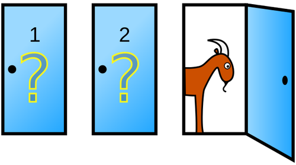
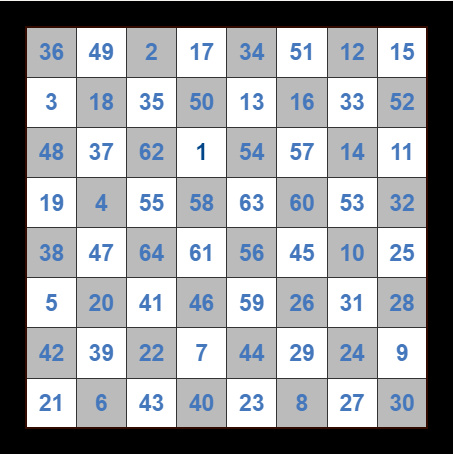
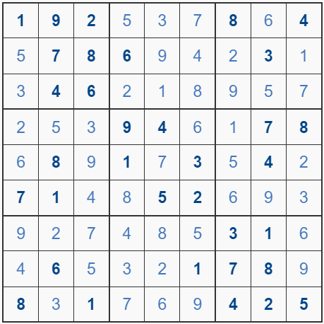
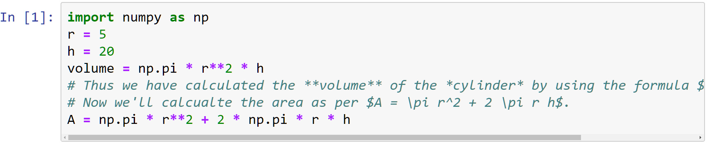

## Hi
I'm manisar ([manisar2](https://github.com/manisar2/manisar2) on Github). 
A coder by hobby, I also find immense interest in physics and calculus.

You can find me on the following platforms sharings bits and pieces of knowledge. 
Among these, [randompearls.com](https://randompearls.com/search/author/2/) is where I've contributed the most because of its great flexibility and control over presentation.

 1. [randompearls.com](https://randompearls.com/search/author/2/)
 2. [github](https://github.com/manisar2/manisar2)
 3. [physics.stackexchange.com](https://physics.stackexchange.com/users/306389/manisar) and other stackexchange sites such as [stackoverflow](https://stackoverflow.com/users/8582902/manisar)
 5. [quora](https://www.quora.com/profile/Manisar)
 6. [Youtube](https://www.youtube.com/channel/UCkNk8sEOPQKfYxYOdWcI3uA) (through [randompearls.com](https://randompearls.com/search/author/2/))

I'm currently into Python and machine learning.

Find below some of my code snipptes, tools, reference guides and musings.

## Online Tools

 * ### [Monty Hall Paradox Test Tool](https://randompearls.com/reference/tools/monty-hall-paradox-tool/)<!--   -->
   Though generally described for 3 doors, the more generalized version as explained in [this page]((https://randompearls.com/reference/tools/monty-hall-paradox-tool/)) can help us understand why it works. 
   In the tool given on [here](https://randompearls.com/reference/tools/monty-hall-paradox-tool/), we can modify the total number of doors (n), the doors selected by the host (y), then the doors opened from those selected doors (x), and the total number of winning doors (t).
   The computer plays against itself 100,000 times and shows the number of wins as per different strategies.

 * ### [Extract Subtitles from YouTube in Plain Text, SRT or VTT Formats](https://randompearls.com/reference/tools/extract-subtitles-youtube-and-convert-plain-text/)
   Use this tool for downloading captions or subtitles from YouTube in plain text or in VTT or SRT formats, in the language of your choice. 
   It can also be used for converting any subtitles, that you already have, from VTT format to text or SRT format.

 * ### [Knight's Tour on A Chessboard](https://randompearls.com/reference/tools/knight-solution/)<!--   -->
   It's possible for a knight on a chessboard to traverse the complete board visiting every position once and only once. 
   Here I'm using backtracking to find such a tour starting with any position. Press '1' in any cell in the grid below and hit Submit.

 * ### [Online Sudoku Solver](https://randompearls.com/reference/tools/sudoku-solver/)<!--   -->
   This page can also be used as service that solves a 9x9 Sudoku. The service is written in Python. 
   With the solved Sudoku, the service also returns some other statistics such as the counts of recursive and non-recursive calls etc.

 * ### [Scrape Stock Quotes](https://randompearls.com/reference/tools/stock-quotes/)
   This is a demo tool that shows how web-scraping can be used to get stock quotes in interesting ways, and in bulk, e.g. from Google Finance.

 

## Tools and Snippets

 * ### [Show Markdown from within Code Cells in Jupyter and VS Code's Interactive Python](https://randompearls.com/science-and-technology/information-technology/coding-and-development-reference-and-tools/show-markdown-within-code-cells-jupyter-and-vs-code-interactive-python/)<!--   -->
   Display markdown from within code cells in IPython output, while ignoring it when run in normal Python (like usual comments). 
   [Code](https://github.com/manisar2/manisar2/tree/main/ipy_code_cell_markdown), [notebook and example](https://github.com/manisar2/manisar2/blob/main/ipy_code_cell_markdown/ipy_md.ipynb).

 * ### [Save Windows Screenshot as jpg File using a Shortcut Key](https://randompearls.com/science-and-technology/information-technology/coding-and-development-reference-and-tools/save-windows-screenshot-jpg-file-one-step-shortcut-script/)
   Save image from clipboard to a jpg file without needing an image processing program. 
   [Code](https://github.com/manisar2/manisar2/tree/main/save_windows_screenshot).

 

## Mathematical Animation
   Blender, manim, desmos, dot and Voicemeeter are the tools I've primarily used for animation.

 * ### [Recurrent Neural Network - Basic Plumbing](https://www.youtube.com/watch?v=ngayHkzoguA&t=1s)
   
 * ### [Numpy Array - Sum, Axes and Dimensions](https://www.youtube.com/watch?v=XC_j0cr_a8U)

 

## Reference Guides

 * ### [How to Make Private Updateable Clone (of third party repos) in Git](https://randompearls.com/science-and-technology/information-technology/coding-and-development-reference-and-tools/how-make-private-updateable-clone-git/) 
   Create private equivalent of a fork of a public repo on github.

 * ### [What's up with VS Code, WSL, Docker and Dev-containers?](https://randompearls.com/science-and-technology/information-technology/coding-and-development-reference-and-tools/vscode-docker-wsl-and-dev-containers/)
   Code, develop, build, test and showcase like a Pro. 

 * ### [Audio Setup with and without External Dock](https://randompearls.com/science-and-technology/information-technology/coding-and-development-reference-and-tools/audio-setup-external-dock/)
   Setup audio both with and without an external dock. Force detection of audio devices including speakers and microphones. 

 

## IT and Mathematics - Concepts and Explanations

 * ### [The Monty Hall Paradox Probability Equations](https://randompearls.com/science-and-technology/mathematics/monty-hall-paradox-probability-equations/)
   While in [Monty Hall Paradox Test Tool]((https://randompearls.com/reference/tools/monty-hall-paradox-tool/)) I focused on explaining the working of this paradox through its results, [here](https://randompearls.com/science-and-technology/mathematics/monty-hall-paradox-probability-equations/) I have derived the equations for the generalized case (for any number of total, opened and winning doors). 
   Nice to see how the results match the equations.

 * ### [Neural Networks - What's Happening? An Intuitive Introduction to Machine Learning](https://randompearls.com/science-and-technology/information-technology/neural-networks-whats-happening-intuitive-intro-to-machine-learning/)
   Multiple chapters. Trying to explain how machine learning is a natural progression of conventional regression using the rapidly advancing processing power, and some of the neat small mathematical tricks we had or discovered in the last century. 
   This, while also shaping up the constructing ideas behind it from the ground-up - for the semi-initiated.

 * ### [Information Theory - Rationale Behind Using Logarithm for Entropy, and Other Explanations](https://randompearls.com/science-and-technology/mathematics/information-theory-rationale-behind-using-logarithm-entropy-and-other-explanations/)
   If you work in, or have interest in Information Technology or Mathematics, then Information Theory is something you must be acquainted with. 
   If you haven't heard of it, check the section Information Theory - Quick Introduction↕ on this page. 
   What I have provided on this is an intuitive build-up which is generally not present in most explanations of the Information Theory - including the one that came from its founder.

 * ### [An Intuitive Look at Euler's Formula (and All the Numbers!)](https://randompearls.com/science-and-technology/mathematics/intuitive-look-at-eulers-formula-and-all-numbers/) 
   If enlightenment came in pieces, I bet the realization which I had and which I've provided on this page, would be one of those!

 * ### [Standard Deviation (σ) vs. Mean Absolute Deviation (MAD)](https://randompearls.com/science-and-technology/mathematics/standard-deviation-vs-mean-absolute-deviation/)
   On a cursory look, MAD seems to be perfect – we want to know – on an average – how far each of the numbers in a set of observations is from their mean (M), and MAD tells us exactly that. 
   Then what is the problem? Why don’t we use MAD everywhere instead of σ?

 * ### [Numpy Array - Sum, Axes and Dimensions](https://randompearls.com/science-and-technology/information-technology/concepts/numpy-array-sum-axes-and-dimensions/)
   A little visualization for understanding this basic stuff.
   You can also look at this [animation](https://randompearls.com/documents/19/Numpy_Array_Sum_Animation.mp4) for a quick overview.

 

## Physics - Intuition Based

 * ### [How Do Objects Fly?](https://randompearls.com/science-and-technology/physics/how-do-objects-fly/)
   With a Thrust-to-Weight Ratio of Less Than 1!

 * ### [How Do Objects Float?](https://randompearls.com/science-and-technology/physics/how-do-objects-float/)
   Multiple Explanations

 * ### [Tensors in Physics - Once and For All](https://randompearls.com/science-and-technology/physics/tensors-physics-once-and-all/)
   If the idea of tensors ever intrigued you and you wanted to get to the real physical understanding of them, this article might help.

 * ### [The Relativity of Physics and The Physics of Relativity](https://randompearls.com/science-and-technology/physics/relativity-physics-physics-relativity/)
   A humble attempt at explaining the relativity of physics and the physics of relativity, with special treatment to vector analysis. 
   Some knowledge of calculus is required.

 

## Fiction

 * ### [A True Story Yet To Happen](https://randompearls.com/fiction-and-poetry/fiction/true-story-yet-to-happen/)
   See if you can make any sense of it. I couldn't since the time I wrote it. It did make some sense before I conceived it though!

 * ### [Stories for Vedantins](https://randompearls.com/vedanta/stories/?langp=en)
   Some short motivational stories, retold.

<!--
**manisar2/manisar2** is a ✨ _special_ ✨ repository because its `README.md` (this file) appears on your GitHub profile.

Here are some ideas to get you started:

- 🔭 I’m currently working on ...
- 🌱 I’m currently learning ...
- 👯 I’m looking to collaborate on ...
- 🤔 I’m looking for help with ...
- 💬 Ask me about ...
- 📫 How to reach me: ...
- 😄 Pronouns: ...
- ⚡ Fun fact: ...
-->
